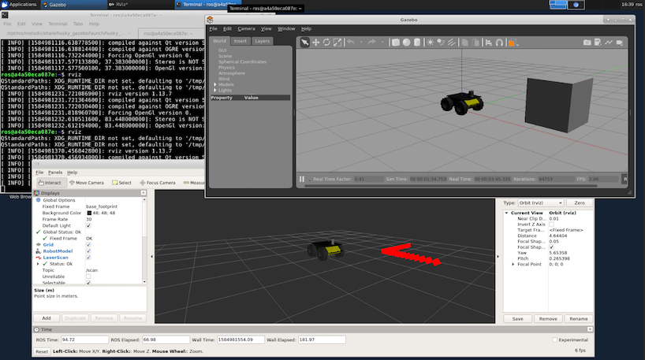

# Docker container for ROS Meldoic with "headless" VNC session

This repository contains a Docker image for ROS Melodic (desktop-full version) that allows to run ROS as a Docker container and access GUIs (rviz, gazebo, ...) via VNC. This repo is forked from two other repos:

* https://github.com/ConSol/docker-headless-vnc-container and 
* https://github.com/henry2423/docker-ros-vnc

More information may be found there.

Each Docker image is installed with the following components:

* Desktop environment [**Xfce4**](http://www.xfce.org)
* VNC-Server (default VNC port `5901`)
* [**noVNC**](https://github.com/novnc/noVNC) - HTML5 VNC client (default http port `6901`)
* [**ROS Melodic**](http://wiki.ros.org/melodic) full desktop version
* [**Visual Studio Code**](https://code.visualstudio.com/)
* Browsers:
  * Mozilla Firefox
  * Chromium

## Currently provided sessions:

* `tdcode/docker-ros-vnc:latest`: Ubuntu 18.04 with ROS Melodic, Tensorflow 2.0, and VNC support

* `tdcode/docker-ros-vnc:nvidia`: Ubuntu 18.04 with GPUs suppoer (via nvidia/cuda:10.1-cudnn7-devel-ubuntu18.04), ROS Melodic, Tensorflow 2.0, and VNC support

# Usage

You will be running the container with following user:

    user: ros
    (sudo) password: ros

## Running without GPU support

* Run command with mapping to local port `5901` (vnc protocol) and `6901` (vnc web access):

      docker run -d -p 5901:5901 -p 6901:6901 -e VNC_RESOLUTION=1920x1080 --rm tdcode/docker-ros-vnc:latest

  Note that `-e VNC_RESOLUTION=1920x1080` may be adjusted to select an approriate screen resolution.
  
* If you want to get into the container use interactive mode `-it` and `bash`

      docker run -it --rm -p 5901:5901 -p 6901:6901 tdcode/docker-ros-vnc:latest bash

## Running with GPU support

This should be basically the same, just replace `docker` by `nvidia-docker` (check out [`https://github.com/NVIDIA/nvidia-docker`](https://github.com/NVIDIA/nvidia-docker) for latest information on how to enable run nvidia docker containers):

* With mapping to local port `5901` (vnc protocol) and `6901` (vnc web access):

      nvidia-docker run -d -p 5901:5901 -p 6901:6901 -e VNC_RESOLUTION=1920x1080 --rm tdcode/docker-ros-vnc:nvidia
  
* Using interactive mode `-it` and `bash`

      nvidiadocker run -it --rm -p 5901:5901 -p 6901:6901 tdcode/docker-ros-vnc:nvidia bash

## Building an image from scratch

If you don't want to use the Dockerhub versions of these images, you may build the images yourself via

    docker build -t docker-ros-nvidia-vnc -f Dockerfile.ubuntu.nvidia.xfce.vnc .

  or

    docker build -t docker-ros-vnc -f Dockerfile.ubuntu.xfce.vnc .

# Connect & Control
If the container is started like mentioned above, connect via one of these options:

* connect via __VNC viewer `localhost:5901`__, default password: `vncpassword`
* connect via __noVNC HTML5 full client__: [`http://localhost:6901/vnc.html`](http://localhost:6901/vnc.html), default password: `vncpassword` 
* connect via __noVNC HTML5 lite client__: [`http://localhost:6901/?password=vncpassword`](http://localhost:6901/?password=vncpassword) 

## Hints

### 1) Override VNC environment variables
The following VNC environment variables can be overwritten at the `docker run` phase to customize your desktop environment inside the container:
* `VNC_COL_DEPTH`, default: `24`
* `VNC_RESOLUTION`, default: `1280x1024`
* `VNC_PW`, default: `my-pw`

#### 1.1) Example: Override the VNC password
Simply overwrite the value of the environment variable `VNC_PW`. For example in
the docker run command:

    docker run -it -p 5901:5901 -p 6901:6901 -e VNC_PW=my-pw consol/centos-xfce-vnc

#### 1.2) Example: Override the VNC resolution
Simply overwrite the value of the environment variable `VNC_RESOLUTION`. For example in
the docker run command:

    docker run -it -p 5901:5901 -p 6901:6901 -e VNC_RESOLUTION=800x600 consol/centos-xfce-vnc
    
### 2) View only VNC
Since version `1.2.0` it's possible to prevent unwanted control via VNC. Therefore you can set the environment variable `VNC_VIEW_ONLY=true`. If set, the startup script will create a random password for the control connection and use the value of `VNC_PW` for view only connection over the VNC connection.

     docker run -it -p 5901:5901 -p 6901:6901 -e VNC_VIEW_ONLY=true tdcode/docker-ros-vnc:latest
